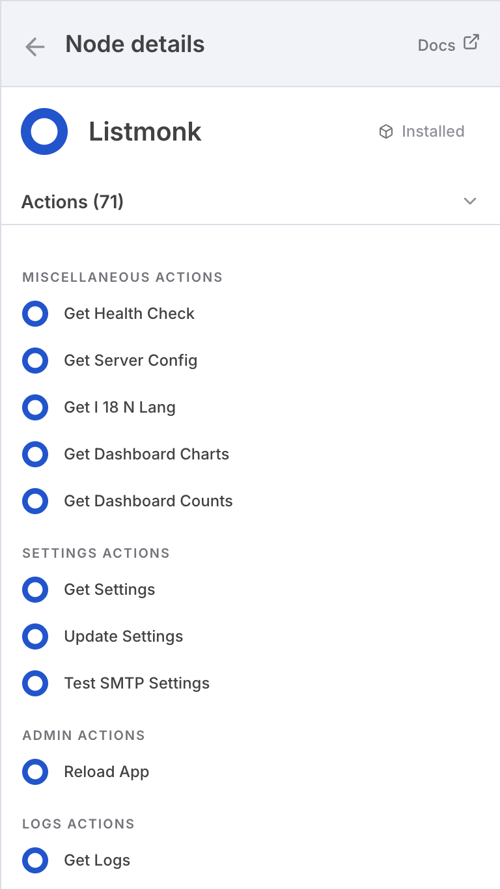
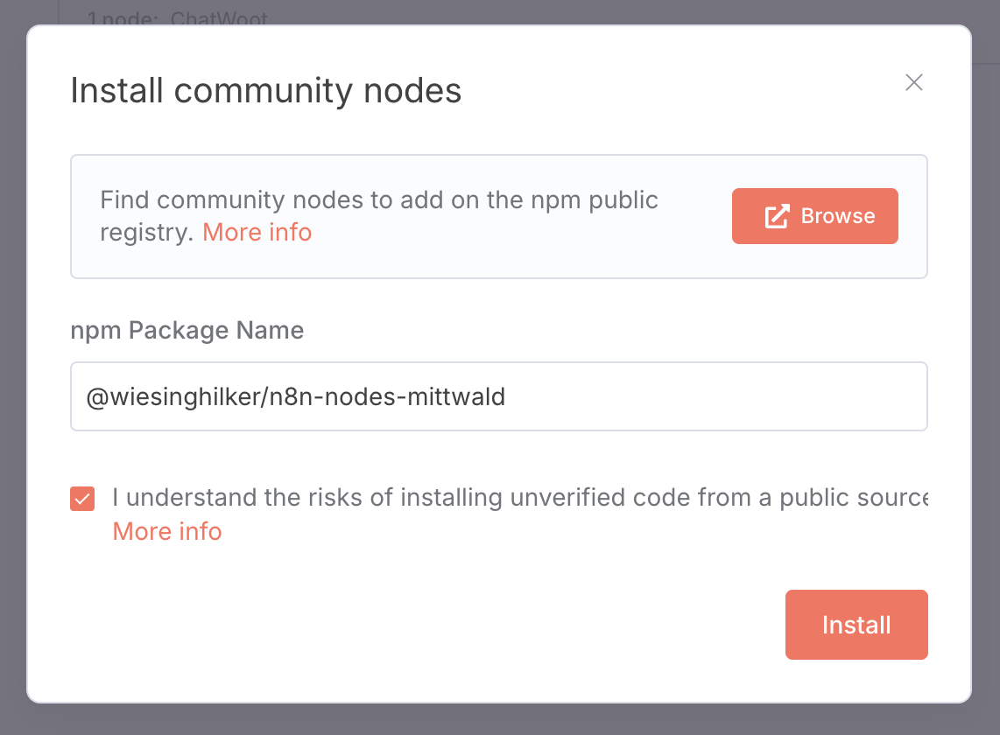

# n8n node for SevDesk API

## Overview

This node integrates the SevDesk API into n8n to manage contacts, invoices, and other accounting resources.

## Installation

Add the `@wiesinghilker/n8n-nodes-sevdesk` package to your n8n installation:

## Configuration

To use the SevDesk API, you need an API token from your SevDesk account. Enter the token in the node credentials. The node sends it as `Authorization` header to `https://my.sevdesk.de/api/v2`.
